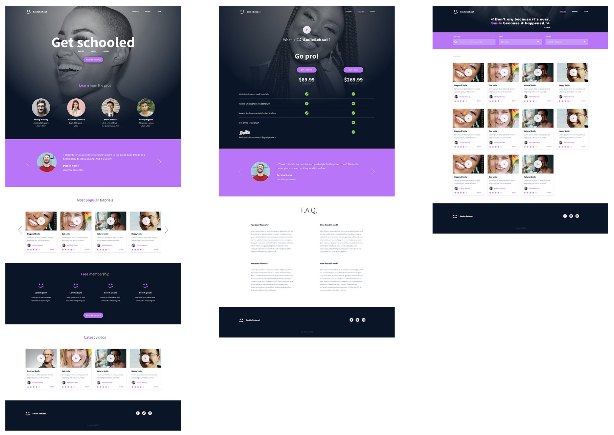
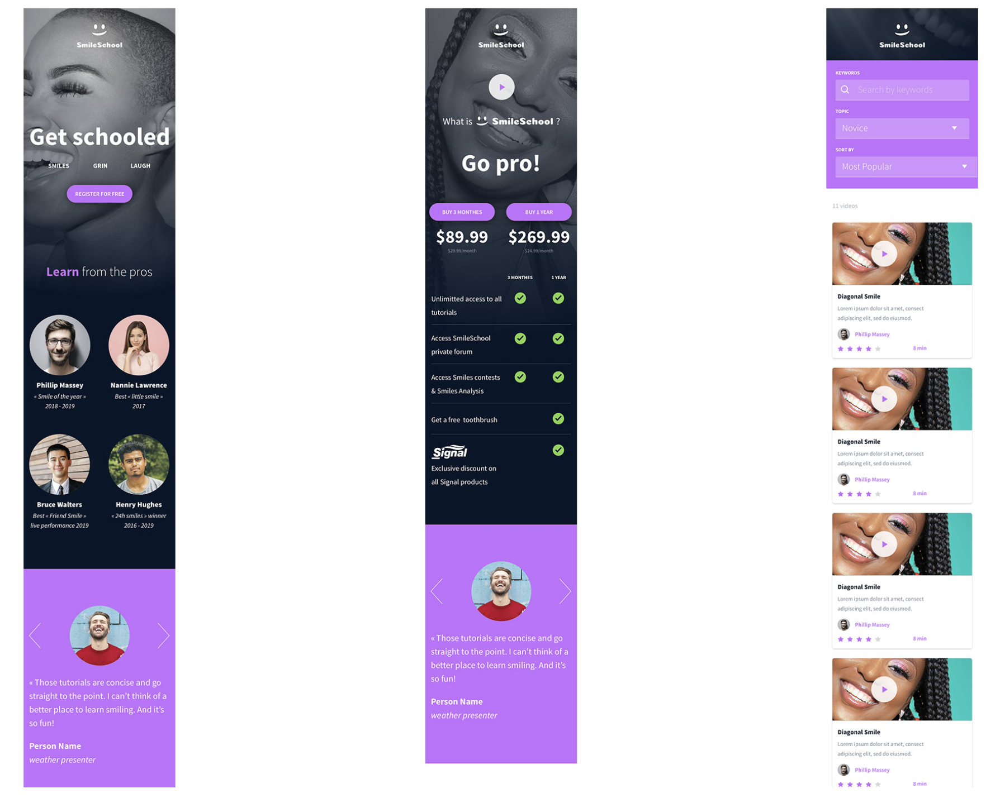

# Atlas-smiling-school

This project is an implementation of the website from scratch. HTML/CSS/Accessibility/Responsive design/Bootstrap knowledge has been used. The website contains three web pages. It has been designed by Nicolas Philippot, and the [figma prototype homepage](https://www.figma.com/file/hcxMqRWjdj06jHycRkbzOf/Homepage?node-id=0%3A1&mode=dev), [figma prototype courses](https://www.figma.com/file/zKRy0vMRBjwHaKBn1WnavS/Courses?node-id=0%3A1&mode=dev) and [figma prototype pricing](https://www.figma.com/file/QQmdkH49hKJuJ6244fBXzH/Pricing?node-id=0%3A1&mode=dev) were used as a reference.

## Directory Structure 📚

```
atlas-headphones/
| -- 0-homepage.html
| -- 1-homepage.html
| -- 2-homepage.html
| -- 3-homepage.html
| -- 4-homepage.html
| -- homepage.html
| -- 0-pricing.html
| -- 1-pricing.html
| -- 2-pricing.html
| -- 3-pricing.html
| -- pricing.html
| -- 0-courses.html
| -- 1-courses.html
| -- 2-courses.html
| -- courses.html
| -- images/
|   | -- ...
| -- styles.css
| -- README.md
```

## End product Desktop/Tablet/Mobile versions 🏆




## Tools/Frameworks used 📖
- HTML
- CSS
- Bootstrap
- Figma

## Author/Contact info :phone: :mailbox:

* **Svitlana Pavlovska** **|** [Github](https://github.com/SvitLanaPavl) **|** [LinkedIn](https://www.linkedin.com/in/svitlana-pavlovska-833b43184/) **|** [Email](mailto:lanapavlovska90@gmail.com)
##
